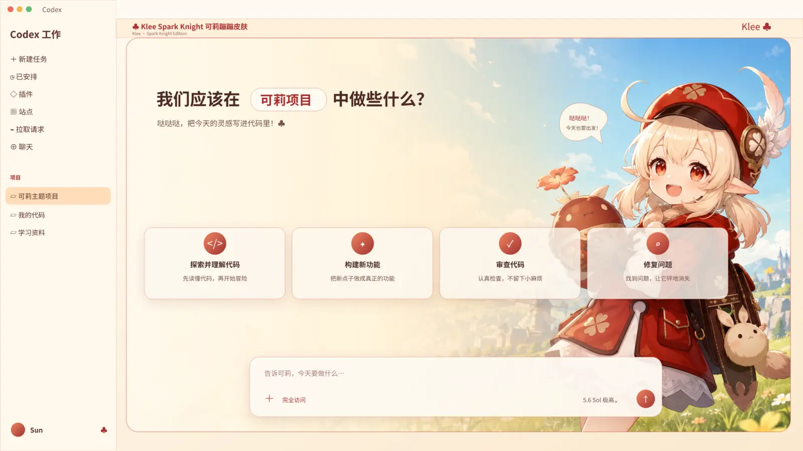
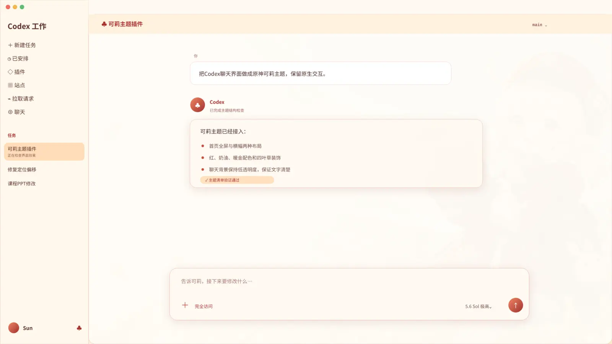

<div align="center">

# 可莉 Codex 主题 · 安全版

一套基于 ChatGPT/Codex 官方“外观”设置的可莉配色，以及用于清理旧版注入残留的 Windows 安全中心。

[](https://github.com/uinaqx/genshin_codexnew/releases/tag/v2.0.0)
[](https://github.com/uinaqx/genshin_codexnew/actions/workflows/windows-installer.yml)
[](https://github.com/uinaqx/genshin_codexnew/actions/workflows/validate.yml)
[](LICENSE)

</div>

> [!CAUTION]
> 请停止使用 v1.1.0–v1.1.3 的 Windows 换肤功能。旧版会通过调试端口启动应用，并包含自动恢复、缓存和账号状态处理逻辑，可能导致新版 ChatGPT/Codex 停在启动画面。v2.0 已将这些代码全部移除。

## Windows 下载

[**下载 KleeCodexSafety-Setup-v2.0.0.exe**](https://github.com/uinaqx/genshin_codexnew/releases/latest/download/KleeCodexSafety-Setup-v2.0.0.exe)

校验文件：[KleeCodexSafety-Setup-v2.0.0.exe.sha256](https://github.com/uinaqx/genshin_codexnew/releases/latest/download/KleeCodexSafety-Setup-v2.0.0.exe.sha256)

这个安装包安装的是“安全中心”，不是注入器。安装、打开和卸载安全中心本身都不会修改 ChatGPT/Codex。它提供：

- 复制可莉配色并打开官方外观设置；
- 查看主题预览；
- 用户确认后清理 v1.x 的已知残留；
- 导出不含账号令牌、文件内容、对话和项目数据的诊断；
- 卸载安全中心。

## 官方方式应用可莉配色

新版 ChatGPT/Codex 已在“设置 → 外观”中支持基础主题、强调色、背景色、前景色和字体。Windows 安全中心会把下面的配色复制到剪贴板并打开设置；macOS 可以双击 `Open Klee Theme Settings on macOS.command`。

| 项目 | 值 |
| --- | --- |
| 基础主题 | 浅色 |
| 强调色 | `#C94A3C` |
| 背景色 | `#FFF9F0` |
| 前景色 | `#4B2B28` |
| 辅助暖金 | `#E8B04A` |

官方目前没有公开、稳定的桌面外观导入文件格式或命令行接口，因此 v2.0 不会替用户写内部配置。需要在官方“外观”页面确认颜色。这一步多一次点击，但不会改变应用启动方式。

## 预览

| 首页概念预览 | 聊天页概念预览 |
| --- | --- |
|  |  |

预览图用于展示配色与视觉方向。v2.0 不会把人物插画注入应用界面；实际可用效果以官方“外观”设置支持的项目为准。

## v2.0 的安全边界

| 行为 | v2.0 |
| --- | --- |
| 修改 ChatGPT/Codex 安装文件 | 不会 |
| 修改应用启动参数 | 不会 |
| 开启调试端口或注入脚本 | 不会 |
| 安装后台 watcher | 不会 |
| 自动重置或重新注册应用包 | 不会 |
| 自动清理官方缓存或登录状态 | 不会 |
| 自动修改 `~/.codex/config.toml` | 不会 |
| 删除 `sessions`、`archived_sessions` 或项目 | 不会 |
| 用户确认后清理 v1.x 精确残留 | 会 |

## 从旧版升级

如果 ChatGPT/Codex 已经能正常打开，可以直接安装 v2.0。打开安全中心后，只有在它提示检测到旧版残留时，再点“安全清理旧版残留”。

清理程序只处理：

- `%LOCALAPPDATA%\CodexDreamSkin`；
- 旧版 watcher 和快捷方式；
- v1.x 写入 `config.toml` 的三项外观键；
- 将旧版状态目录整体移到桌面备份，而不是直接删除。

它不会清理官方应用缓存，也不会重置应用包。详细故障复盘见 [docs/INCIDENT-2026-07.md](docs/INCIDENT-2026-07.md)。

## 当前支持状态

| 平台 | 状态 | 使用方式 |
| --- | --- | --- |
| Windows 10/11 | 已验证安全中心构建与静态安全契约 | 安装 v2.0，手动确认官方外观颜色 |
| macOS | 无注入辅助脚本 | 双击设置助手，手动确认官方外观颜色 |
| Windows/macOS 人物背景注入 | 已停用 | 等待官方公开稳定扩展接口 |

## 开发验证

```bash
node tests/test-palette.mjs
node tests/test-windows-safety.mjs
```

Windows CI 还会使用 PowerShell 解析器检查两份脚本，再用 Inno Setup 构建安装包并生成 SHA-256。安全契约会阻止调试端口、应用包重置和旧版注入文件重新进入主分支。

## 声明

这是非官方、非商业的同人项目，与 OpenAI、HoYoverse 无隶属或合作关系。代码使用 MIT 许可证；角色形象、游戏名称和相关标识不属于 MIT 授权内容。素材说明见 [ASSET_PROVENANCE.md](ASSET_PROVENANCE.md)。
